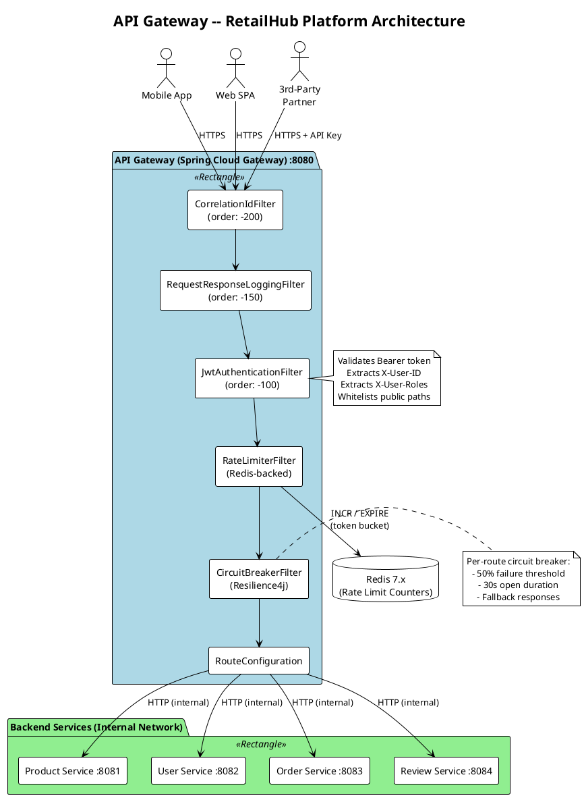
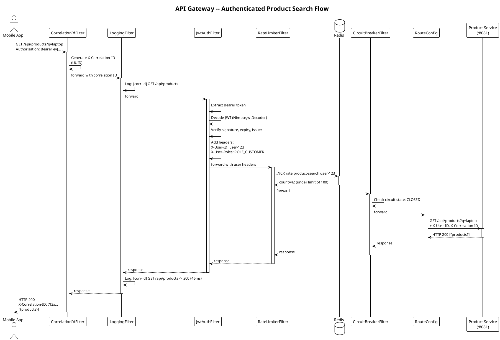
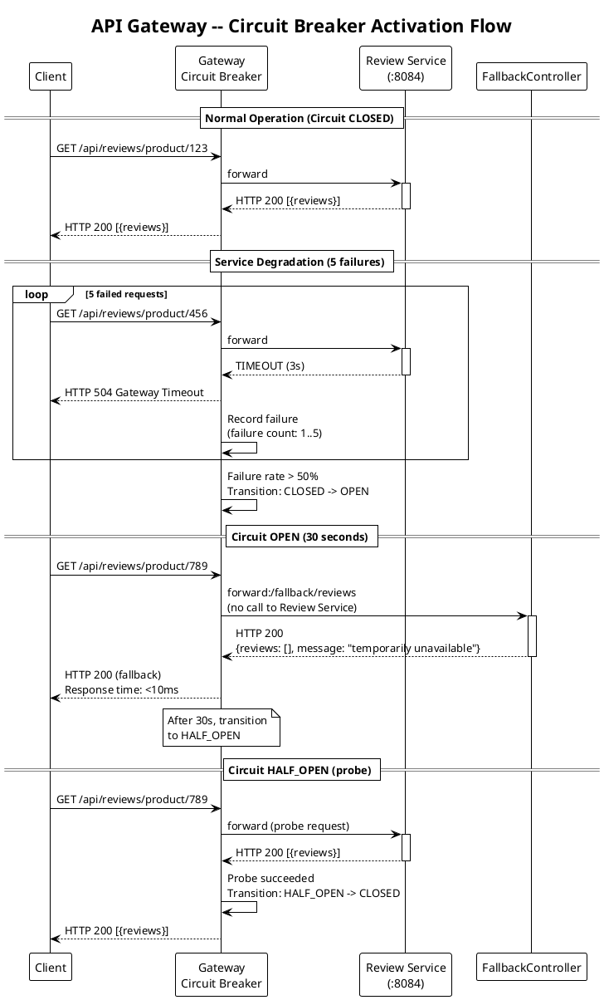

# API Gateway -- Real-World Scenario

## RetailHub -- Multi-Service Retail Platform

### Business Context

**RetailHub** is an online retail platform that has decomposed its monolith into five backend microservices:

| Service | Port | Responsibility | Team |
|---------|------|---------------|------|
| **Product Service** | 8081 | Product catalog, search, inventory | Catalog Team |
| **User Service** | 8082 | Registration, profiles, preferences | Identity Team |
| **Order Service** | 8083 | Order placement, history, tracking | Commerce Team |
| **Review Service** | 8084 | Product reviews and ratings | Content Team |
| **Notification Service** | 8085 | Email, SMS, push notifications | Platform Team |

Each service is independently deployed, has its own database, and exposes its own REST API.

---

### The Business Problem

Without a gateway, clients face multiple challenges:

**1. Client Complexity -- Too Many Endpoints**

The mobile app must know about 5 different hostnames and ports:
```
https://products.internal:8081/api/products/123
https://users.internal:8082/api/users/me
https://orders.internal:8083/api/orders
https://reviews.internal:8084/api/products/123/reviews
https://notifications.internal:8085/api/preferences
```

Every time a service is added, renamed, or re-hosted, every client must be updated.

**2. Duplicated Security Logic**

Each service independently implements JWT validation, role checking, and CORS headers. Bugs in one service's auth logic create security vulnerabilities:

```
Product Service:  validates JWT  (correct implementation)
Order Service:    validates JWT  (missing expiry check -- BUG)
Review Service:   no JWT check   (accidentally exposed)
```

**3. No Rate Limiting**

A malicious bot hits the Product Search API at 10,000 requests/second. Without centralised rate limiting, the Product Service database is overwhelmed, and the entire catalog goes down.

**4. Cascading Failures**

The Review Service experiences a database outage. The mobile app's product detail page calls the Review Service synchronously. Without a circuit breaker, every product page request hangs for 30 seconds (connection timeout), backing up the Product Service's thread pool, and eventually taking down the entire platform.

**5. No Unified Logging or Tracing**

When a customer reports "my order page is slow," the support team must check logs across 5 services. There is no correlation ID linking the request across service boundaries.

---

### Why the API Gateway Solves This

| Problem | How the Gateway Fixes It |
|---------|-------------------------|
| Too many endpoints | Single entry point (`gateway:8080`). Clients know one hostname. Routing rules map paths to services. |
| Duplicated security | JWT validation happens **once** in the gateway's global filter. Backend services trust the gateway (internal network). |
| No rate limiting | Redis-backed rate limiter filter applied per route. Product search gets 100 req/sec per user; order placement gets 10 req/sec. |
| Cascading failures | Resilience4j circuit breaker on each route. If the Review Service fails, the circuit opens and returns a fallback (empty reviews) in <10ms instead of hanging for 30 seconds. |
| No unified logging | The gateway adds a `X-Correlation-ID` header to every request. All services log this ID. Support can trace a request end-to-end. |

---

### Architecture Diagram (PlantUML)



### Sequence Diagram -- Authenticated Request Flow (PlantUML)



### Sequence Diagram -- Circuit Breaker Activation (PlantUML)



**Rendered as ASCII:**

```
  Mobile App      Web SPA       3rd-Party Partner
      |              |                |
      +--------------+----------------+
                     |
              HTTPS :8080
                     |
     +---------------v-----------------+
     |         API GATEWAY             |
     |  (Spring Cloud Gateway)         |
     |                                 |
     |  1. CorrelationId Filter        |
     |  2. JWT Authentication Filter   |
     |  3. Rate Limiter (Redis)        |
     |  4. Circuit Breaker (R4j)       |
     |  5. Route to Backend            |
     +--+--------+--------+--------+--+
        |        |        |        |
   /products  /users   /orders  /reviews
        |        |        |        |
   +----v--+ +---v---+ +--v----+ +-v------+
   |Product| | User  | | Order | | Review |
   |Service| |Service| |Service| | Service|
   | :8081 | | :8082 | | :8083 | | :8084  |
   +-------+ +-------+ +-------+ +--------+
```

---

### Request Flow -- Step by Step

#### Flow 1: Authenticated Product Search

```
Step 1   Mobile app sends:
         GET https://gateway:8080/api/products?q=laptop&page=0
         Authorization: Bearer eyJhbGciOi...

Step 2   CorrelationIdFilter generates X-Correlation-ID: 7f3a9b2c-...
         and attaches it to the request headers.

Step 3   JwtAuthenticationFilter extracts the Bearer token:
         - Verifies the signature against the JWKS endpoint.
         - Checks expiration (exp claim).
         - Extracts user ID and roles from claims.
         - Adds X-User-ID and X-User-Roles headers for downstream use.
         - If validation fails: returns HTTP 401 immediately.

Step 4   RateLimiterFilter checks Redis:
         Key: "rate:product-search:{userId}"
         Limit: 100 requests per 10-second window.
         - If under limit: increments counter, proceeds.
         - If over limit: returns HTTP 429 Too Many Requests
           with Retry-After header.

Step 5   CircuitBreakerFilter checks the Product Service circuit state:
         - CLOSED (healthy): route the request normally.
         - OPEN (unhealthy): return fallback response immediately.
         - HALF_OPEN: allow a probe request through.

Step 6   RouteConfiguration matches /api/products/** to
         http://product-service:8081 and forwards the request.

Step 7   Product Service processes the search and returns results.

Step 8   Gateway relays the response to the mobile app with
         the X-Correlation-ID header preserved.
```

#### Flow 2: Circuit Breaker Activation

```
Step 1   Review Service's database goes down.

Step 2   The next 5 requests to /api/reviews/** timeout after 3 seconds each.

Step 3   The circuit breaker's failure rate exceeds the threshold (50%).
         The circuit transitions from CLOSED to OPEN.

Step 4   For the next 30 seconds (configured wait duration), all requests
         to /api/reviews/** receive an immediate fallback response:
         HTTP 200 with body: { "reviews": [], "message": "Reviews temporarily unavailable" }
         Response time: <10ms (no call to backend).

Step 5   After 30 seconds, the circuit transitions to HALF_OPEN.
         One probe request is sent to the Review Service.
         - If it succeeds: circuit returns to CLOSED.
         - If it fails: circuit returns to OPEN for another 30 seconds.

Step 6   Other routes (Product, User, Order) are completely unaffected.
         No cascading failure.
```

#### Flow 3: Rate Limiting in Action

```
Step 1   A bot sends 200 requests/second to GET /api/products.

Step 2   The first 100 requests in the 10-second window succeed.

Step 3   Requests 101+ receive:
         HTTP 429 Too Many Requests
         Retry-After: 7
         X-RateLimit-Remaining: 0
         X-RateLimit-Limit: 100

Step 4   After the window resets, the counter starts fresh.

Step 5   Legitimate users on other routes are unaffected.
         Rate limits are per-route and per-user, not global.
```

---

### Client Simplification

**Before Gateway (client knows 5 endpoints):**

```javascript
// Mobile app configuration
const PRODUCT_API = 'https://products.retailhub.com:8081';
const USER_API    = 'https://users.retailhub.com:8082';
const ORDER_API   = 'https://orders.retailhub.com:8083';
const REVIEW_API  = 'https://reviews.retailhub.com:8084';
const NOTIF_API   = 'https://notifications.retailhub.com:8085';
```

**After Gateway (client knows 1 endpoint):**

```javascript
// Mobile app configuration
const API_BASE = 'https://api.retailhub.com';
// All routes: /api/products, /api/users, /api/orders, /api/reviews
```

---

### Trade-offs

| Advantage | Cost |
|-----------|------|
| Single entry point for clients | Gateway is a **single point of failure** (mitigate with multiple instances + load balancer) |
| Centralised authentication and authorization | Added **network hop** for every request (~1-5ms latency) |
| Per-route rate limiting | Requires **Redis** infrastructure for distributed counters |
| Circuit breaking prevents cascading failures | Gateway must be **kept up to date** when new services/routes are added |
| Unified logging with correlation IDs | Gateway can become a **bottleneck** if not horizontally scaled |
| Protocol translation (REST to gRPC) | **Increased operational complexity** (one more service to deploy, monitor, and debug) |

---

### Why Spring Cloud Gateway (Not Alternatives)

| Criterion | Spring Cloud Gateway | Netflix Zuul 2 | Kong | AWS API Gateway |
|-----------|---------------------|----------------|------|-----------------|
| Reactive (non-blocking I/O) | Yes (Project Reactor) | Yes (Netty) | Yes (Nginx) | Managed |
| Spring ecosystem integration | Native | Limited | None | None |
| Programmatic filters in Java | Yes | Yes | Lua plugins | Lambda authorizers |
| Circuit breaker integration | Resilience4j (native) | Hystrix (deprecated) | Plugin | None (use Lambda) |
| Rate limiting | Built-in (Redis) | Custom | Plugin | Built-in (managed) |
| Self-hosted | Yes | Yes | Yes | No (AWS only) |
| Learning curve for Spring teams | Low | Medium | High | Medium |

**Decision:** Spring Cloud Gateway is the best fit for a Java/Spring team. It is reactive (handles high concurrency with fewer threads), integrates natively with Spring Security and Resilience4j, and allows custom filters in familiar Java code.

---

### Best Practices for This Scenario

1. **Order filters deliberately.** Correlation ID (-200) runs first, then logging (-150), then JWT (-100), then rate limiting and circuit breaking. This ensures every request has traceability before any filter rejects it.
2. **Return meaningful fallback responses.** The Review Service fallback returns `200 OK` with an empty reviews array, allowing the product page to render without reviews. The Order Service fallback returns `503` because partial order data is dangerous.
3. **Configure different rate limits per route.** Product search (read-heavy) gets 100 req/10s; order placement (write, financial) gets 10 req/10s. One size does not fit all.
4. **Use `X-User-ID` header propagation.** After JWT validation, the gateway adds `X-User-ID` and `X-User-Roles` headers. Backend services trust these headers because they trust the internal network. This eliminates redundant JWT validation in every service.
5. **Test with WireMock stubs.** Use WireMock containers to simulate backend services during gateway integration tests. This decouples gateway testing from backend availability.

---

*Next: [implementation.md](./implementation.md) -- full Spring Cloud Gateway implementation.*
