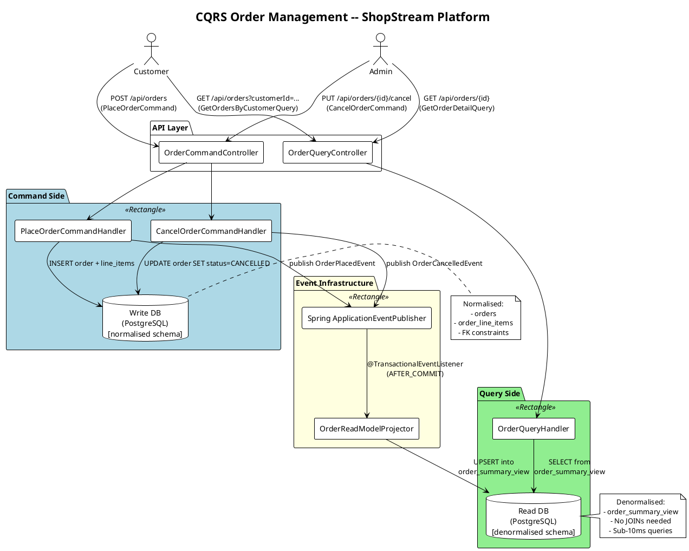
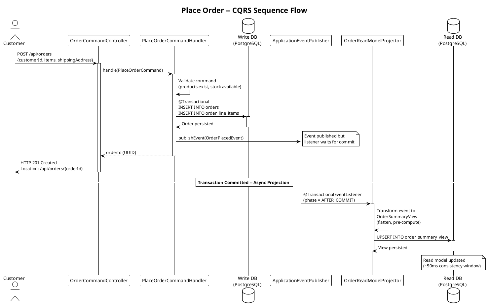

# CQRS -- Real-World Scenario

## E-Commerce Order Management System

### Business Context

**ShopStream** is a mid-to-large e-commerce platform processing **12,000 orders per hour** at peak. The engineering team has identified a critical scalability bottleneck: the single `orders` database table serves both the transactional order-placement pipeline and the customer-facing order-history dashboard.

**The numbers tell the story:**

| Metric | Write Path | Read Path |
|--------|-----------|-----------|
| Peak requests/sec | 3.3 (placing/cancelling orders) | 330 (order history, status checks) |
| Read-to-write ratio | 1 | **100:1** |
| Acceptable latency | 500ms (user waits for confirmation) | 50ms (dashboard must feel instant) |
| Schema shape | Normalised (orders, line_items, addresses, payments) | Flat/denormalised (single-row per order with embedded items) |
| Scaling strategy | Vertical (strong consistency) | Horizontal (replicas, caching) |

A single shared model forces compromises on both sides: writes pay the penalty of maintaining denormalised indexes, and reads pay the penalty of multi-table JOINs.

---

### The Business Problem

1. **Customer dashboard is slow.** Order history queries join 5 tables. At peak load, p99 latency exceeds 2 seconds.
2. **Order placement contends with reads.** Long-running analytical queries hold row-level locks that delay transactional inserts.
3. **Schema evolution is risky.** Adding a column for the read side (e.g., `estimated_delivery_date`) forces a migration that affects the write side, requiring coordinated downtime.
4. **No audit trail.** The current system performs `UPDATE` in place, losing previous state. Compliance requires knowing who changed what and when.

---

### Why CQRS Solves This

CQRS splits the single model into two purpose-built models:

| Concern | Before (Single Model) | After (CQRS) |
|---------|----------------------|--------------|
| Order placement | INSERT into normalised tables with FK constraints | Command handler validates and persists to **write store**; publishes `OrderPlacedEvent` |
| Order history | JOIN across 5 tables, sorted by date | Query handler reads from **denormalised read store** -- single-table scan, sub-10ms |
| Schema changes | One migration affects everything | Read and write schemas evolve independently |
| Audit trail | Lost on UPDATE | Every command is logged; events form an immutable history |
| Scaling | One database, one connection pool | Write DB scales vertically; read replicas scale horizontally |

---

### Architecture Diagram (PlantUML)



### Sequence Diagram -- Place Order Flow (PlantUML)



**Rendered as ASCII:**

```
 Customer/Admin
      |
      v
+-----+------+       +------+------+
| Command API |       |  Query API  |
| (POST/PUT)  |       |   (GET)     |
+-----+------+       +------+------+
      |                      |
      v                      v
+-----+------+       +------+------+
|  Command   |       |   Query    |
|  Handlers  |       |  Handlers  |
+-----+------+       +------+------+
      |                      |
      v                      ^
+-----+------+       +------+------+
| Write DB   |       |  Read DB   |
| (normalised)|      |(denormalisd)|
+-----+------+       +------+------+
      |                      ^
      |   +------------+     |
      +-->| Event Bus  |-----+
          | (projector)|
          +------------+
```

---

### Data Flow -- Step by Step

#### Flow 1: Placing an Order

```
Step 1  Customer submits POST /api/orders with cart items and shipping address.

Step 2  OrderCommandController deserialises the request into a PlaceOrderCommand.

Step 3  PlaceOrderCommandHandler validates:
        - All product IDs exist
        - Quantities are available
        - Customer has a valid payment method

Step 4  Handler persists the Order aggregate (order + line_items + payment_record)
        to the WRITE database inside a single @Transactional boundary.

Step 5  After the transaction commits, the handler publishes an OrderPlacedEvent
        via Spring's ApplicationEventPublisher.

Step 6  OrderReadModelProjector receives the event
        (annotated with @TransactionalEventListener(phase = AFTER_COMMIT)).

Step 7  Projector transforms the event into a flat OrderSummaryView row and
        UPSERTs it into the READ database.

Step 8  Customer receives HTTP 201 with the order ID.
```

#### Flow 2: Querying Order History

```
Step 1  Customer opens the "My Orders" dashboard.

Step 2  Frontend sends GET /api/orders?customerId=123&page=0&size=20.

Step 3  OrderQueryController creates a GetOrdersByCustomerQuery.

Step 4  OrderQueryHandler executes a simple SELECT against the READ database's
        order_summary table -- no JOINs, no computed columns.

Step 5  Results are returned as a Page<OrderSummaryView> in under 10ms.
```

#### Flow 3: Cancelling an Order

```
Step 1  Admin submits PUT /api/orders/{id}/cancel.

Step 2  CancelOrderCommandHandler loads the Order from the write store.

Step 3  Handler verifies the order is in a cancellable state (not shipped).

Step 4  Handler updates the order status to CANCELLED and persists.

Step 5  OrderCancelledEvent is published.

Step 6  Projector updates the read model -- sets status to CANCELLED,
        updates cancellation timestamp.
```

---

### Eventual Consistency Window

The read model is **eventually consistent** with the write model. In this implementation, the consistency window is typically **under 50 milliseconds** because:

- We use Spring's in-process `ApplicationEventPublisher` (no network hop).
- The projector runs in a separate transaction that starts immediately after the command transaction commits.
- There is no message broker involved for this in-process variant.

For distributed deployments (separate read and write services), the consistency window increases to **100--500ms** when using Kafka or RabbitMQ as the event transport.

**Mitigations for the consistency gap:**

1. **Read-your-own-writes**: After a command, redirect the client to a confirmation page that reads from the write store (not the read model).
2. **Optimistic UI**: The frontend updates its local state immediately and reconciles on the next poll.
3. **Version stamping**: Each event carries a version number; the query API can indicate "data as of version N".

---

### Trade-offs

| Advantage | Cost |
|-----------|------|
| Independent scaling of reads and writes | Two data stores to maintain |
| Schema optimised per access pattern | Eventual consistency between models |
| Audit trail via events | Increased code complexity (handlers, projectors) |
| Teams can work in parallel on each side | Debugging requires tracing through events |
| Natural path to Event Sourcing | Requires idempotent projectors |

---

### Best Practices for This Scenario

1. **Pre-compute aggregations in the projector.** The `itemsSummary` field ("Wireless Keyboard x2, USB-C Hub x1") is computed once during projection, not on every read query. This moves computation from the hot read path to the cold projection path.

2. **Use composite indexes on the read store.** The `(customer_id, placed_at DESC)` index serves the most common query (customer order history) as an index-only scan.

3. **Design events for projector self-sufficiency.** The `OrderPlacedEvent` carries all product names, quantities, and prices so the projector never needs to call the Product Service or query the write store.

4. **Handle projector failures gracefully.** If the projector throws an exception, the event is lost (in the in-process variant). For production systems, use a message broker (Kafka) between the write side and the projector, or implement a compensating re-projection job.

5. **Test eventual consistency explicitly.** Write integration tests that verify the read model is eventually consistent with the write model within the stated SLA (50ms for in-process, 500ms for Kafka-based).

---

*Next: [implementation.md](./implementation.md) -- full Java code for this scenario.*
