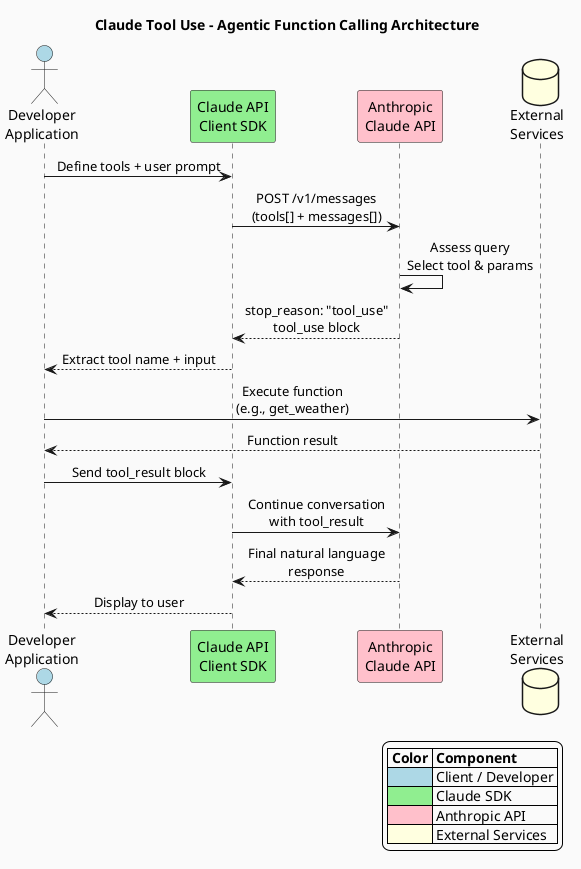

# LinkedIn Post - 2026-02-24
## Topic: Claude Tool Use & Function Calling - Building Agentic Systems

---

### POST CONTENT (Copy below for LinkedIn)

---

What if your AI could call any function, query any API, and orchestrate real-world actions -- all on its own?

That is exactly what Claude Tool Use (Function Calling) enables. It is one of the highest-leverage capabilities you can give an AI agent, and on benchmarks like SWE-bench, adding even simple tools produces outsized capability gains that often surpass human expert baselines.

Here is how it works: you define tool contracts (name, description, input schema), send them alongside your prompt, and Claude decides when and how to call them. The model returns a structured `tool_use` block; your application executes the function and feeds the result back as a `tool_result`.

--

ARCHITECTURE (PlantUML)



--

PYTHON IMPLEMENTATION

```python
"""
Claude Tool Use Example - Agentic Function Calling
Demonstrates how to define tools, handle tool_use responses,
and feed results back to Claude for a complete agentic loop.
"""
import os
import json
from typing import Any

import anthropic


def get_weather(location: str, unit: str = "celsius") -> dict[str, Any]:
    """Simulate fetching weather data for a given location."""
    # In production, call a real weather API here
    return {"location": location, "temperature": 15, "unit": unit, "condition": "partly cloudy"}


# Map tool names to actual Python functions
TOOL_REGISTRY: dict[str, callable] = {
    "get_weather": get_weather,
}

# Define the tool schema that Claude will use to decide when to call this function
TOOLS = [
    {
        "name": "get_weather",
        "description": "Get the current weather in a given location",
        "input_schema": {
            "type": "object",
            "properties": {
                "location": {
                    "type": "string",
                    "description": "The city and state, e.g. San Francisco, CA",
                },
                "unit": {
                    "type": "string",
                    "enum": ["celsius", "fahrenheit"],
                    "description": "Temperature unit: celsius or fahrenheit",
                },
            },
            "required": ["location"],
        },
    }
]


def run_agentic_loop(user_message: str) -> str:
    """
    Run a full agentic tool-use loop with Claude.

    Sends the user message, handles any tool_use responses by executing
    the corresponding function, and returns Claude's final answer.
    """
    client = anthropic.Anthropic(
        api_key=os.environ.get("ANTHROPIC_API_KEY")
    )

    messages = [{"role": "user", "content": user_message}]

    while True:
        # Send request to Claude with tool definitions
        response = client.messages.create(
            model="claude-sonnet-4-6",
            max_tokens=1024,
            tools=TOOLS,
            messages=messages,
        )

        # If Claude stops normally, return the text response
        if response.stop_reason == "end_turn":
            return "".join(
                block.text for block in response.content if block.type == "text"
            )

        # If Claude wants to use a tool, execute it and loop back
        if response.stop_reason == "tool_use":
            # Append the assistant's response (contains tool_use block)
            messages.append({"role": "assistant", "content": response.content})

            # Process each tool_use block in the response
            tool_results = []
            for block in response.content:
                if block.type == "tool_use":
                    func = TOOL_REGISTRY.get(block.name)
                    if func:
                        result = func(**block.input)
                    else:
                        result = {"error": f"Unknown tool: {block.name}"}

                    tool_results.append({
                        "type": "tool_result",
                        "tool_use_id": block.id,
                        "content": json.dumps(result),
                    })

            # Send tool results back to Claude
            messages.append({"role": "user", "content": tool_results})

        else:
            # Unexpected stop reason
            return f"Unexpected stop reason: {response.stop_reason}"


if __name__ == "__main__":
    answer = run_agentic_loop("What is the weather like in San Francisco?")
    print(answer)
```

--

JAVA IMPLEMENTATION

```java
/**
 * Claude Tool Use Example - Agentic Function Calling in Java
 *
 * Demonstrates defining tools, handling tool_use responses,
 * and completing the agentic loop using the official Anthropic Java SDK.
 *
 * Maven dependency:
 * <dependency>
 *     <groupId>com.anthropic</groupId>
 *     <artifactId>anthropic-java</artifactId>
 *     <version>1.5.0</version>
 * </dependency>
 */
import com.anthropic.client.AnthropicClient;
import com.anthropic.client.okhttp.AnthropicOkHttpClient;
import com.anthropic.core.JsonValue;
import com.anthropic.models.messages.*;
import com.anthropic.models.messages.Tool.InputSchema;

import java.util.List;
import java.util.Map;

public class ClaudeToolUseExample {

    /**
     * Simulates a weather lookup. In production, call a real weather API.
     */
    private static String getWeather(String location, String unit) {
        return String.format(
            "{\"location\":\"%s\",\"temperature\":15,\"unit\":\"%s\",\"condition\":\"partly cloudy\"}",
            location, unit != null ? unit : "celsius"
        );
    }

    /**
     * Dispatches a tool call to the correct local function.
     */
    private static String executeTool(String toolName, Map<String, Object> input) {
        return switch (toolName) {
            case "get_weather" -> getWeather(
                (String) input.get("location"),
                (String) input.getOrDefault("unit", "celsius")
            );
            default -> "{\"error\":\"Unknown tool: " + toolName + "\"}";
        };
    }

    public static void main(String[] args) {
        // Initialize client -- reads ANTHROPIC_API_KEY from environment
        AnthropicClient client = AnthropicOkHttpClient.fromEnv();

        // Define tool input schema
        InputSchema weatherSchema = InputSchema.builder()
                .properties(JsonValue.from(Map.of(
                        "location", Map.of(
                                "type", "string",
                                "description", "The city and state, e.g. San Francisco, CA"
                        ),
                        "unit", Map.of(
                                "type", "string",
                                "enum", List.of("celsius", "fahrenheit"),
                                "description", "Temperature unit"
                        )
                )))
                .putAdditionalProperty("required", JsonValue.from(List.of("location")))
                .build();

        // Build the initial request with tool definitions
        MessageCreateParams params = MessageCreateParams.builder()
                .model(Model.CLAUDE_SONNET_4_6)
                .maxTokens(1024)
                .addTool(Tool.builder()
                        .name("get_weather")
                        .description("Get the current weather in a given location")
                        .inputSchema(weatherSchema)
                        .build())
                .addUserMessage("What is the weather like in San Francisco?")
                .build();

        Message response = client.messages().create(params);

        // Check if Claude wants to call a tool
        if ("tool_use".equals(response.stopReason().toString())) {
            response.content().forEach(block -> {
                // Process tool_use blocks
                block.accept(new ContentBlock.Visitor<Void>() {
                    @Override
                    public Void visitToolUse(ToolUseBlock toolUse) {
                        System.out.println("Tool called: " + toolUse.name());
                        System.out.println("Input: " + toolUse.input());

                        // Execute the tool and print the result
                        String result = executeTool(toolUse.name(), Map.of(
                                "location", "San Francisco, CA",
                                "unit", "celsius"
                        ));
                        System.out.println("Result: " + result);
                        return null;
                    }

                    @Override
                    public Void visitText(TextBlock text) {
                        System.out.println(text.text());
                        return null;
                    }

                    @Override
                    public Void visitThinking(ThinkingBlock thinking) { return null; }

                    @Override
                    public Void visitRedactedThinking(RedactedThinkingBlock block) { return null; }
                });
            });
        } else {
            // Direct text response
            response.content().forEach(block ->
                block.accept(new ContentBlock.Visitor<Void>() {
                    @Override
                    public Void visitText(TextBlock text) {
                        System.out.println(text.text());
                        return null;
                    }
                    @Override
                    public Void visitToolUse(ToolUseBlock block) { return null; }
                    @Override
                    public Void visitThinking(ThinkingBlock block) { return null; }
                    @Override
                    public Void visitRedactedThinking(RedactedThinkingBlock block) { return null; }
                })
            );
        }
    }
}
```

--

DEVELOPER GUIDELINES (Python & Java)

- Always validate tool inputs before execution. Claude generates structured JSON, but defensive checks prevent runtime errors in both languages.
- Use `strict: true` in your tool definitions (Structured Outputs) to guarantee schema conformance -- eliminates type mismatches in production.
- Implement a tool registry pattern (Python dict / Java switch expression) to decouple tool dispatch from API handling.
- Set reasonable `max_tokens` limits. Tool-use responses consume tokens for both the tool_use block and the final answer.
- Handle the `pause_turn` stop reason for server-side tools. The sampling loop defaults to 10 iterations; send the response back to let Claude finish.

--

KEY TAKEAWAYS

- Claude Tool Use transforms a language model into an agentic system that can call any function you define -- weather APIs, databases, internal services, or anything else.
- The 4-step loop (define tools, receive tool_use, execute, return tool_result) works identically across Python and Java SDKs.
- Adding `strict: true` to input schemas guarantees type-safe tool calls in production.

--

Tool Use is the building block behind every AI agent worth deploying. Have you started integrating function calling into your applications? Drop your use case in the comments -- I would love to hear what you are building.

--

#Claude #AI #Anthropic #Python #Java #LLM #GenerativeAI #DeveloperTools #ToolUse #FunctionCalling #AIAgents #ClaudeAPI #SoftwareArchitecture

---

### POST METADATA

- **Date**: 2026-02-24
- **Topic Category**: Tool Use & Function Calling
- **Content Calendar Slot**: #3 (Tool Use & Function Calling)
- **Tutorial Source**: https://platform.claude.com/docs/en/docs/build-with-claude/tool-use/overview
- **Models Referenced**: claude-sonnet-4-6 (Python), Claude Sonnet 4.6 (Java)
- **Character Count (post body)**: ~1,800
