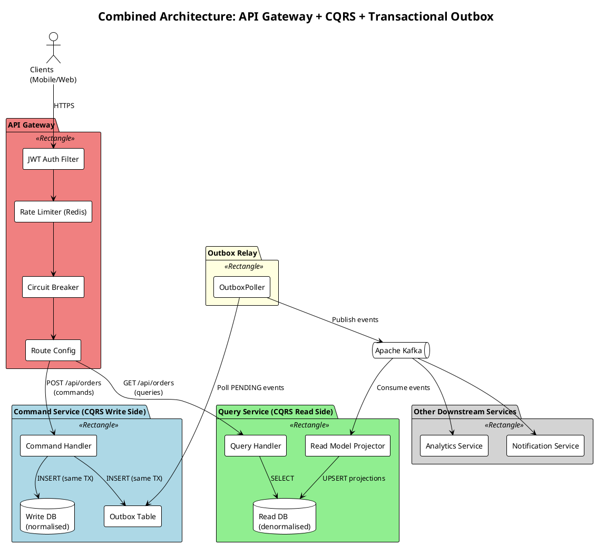
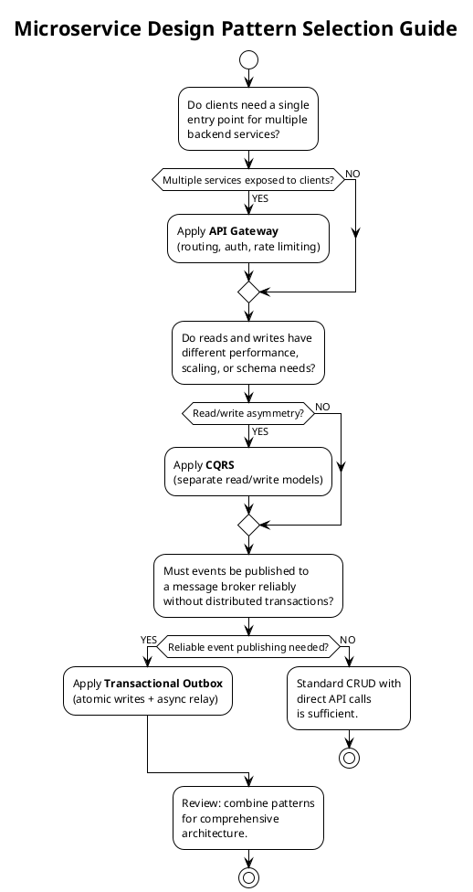

# Microservice Design Patterns -- Selection Guide

> **Date:** 2026-02-28 | **Author:** Saurabh Sharma | **Version:** 1.1

---

## Executive Overview

This document covers three foundational microservice design patterns that address distinct architectural challenges in distributed systems:

1. **CQRS (Command Query Responsibility Segregation)** -- Separates the write (command) model from the read (query) model, enabling each to be optimised, scaled, and evolved independently. Best applied when read and write workloads have fundamentally different characteristics.

2. **Transactional Outbox** -- Guarantees reliable event publishing by writing outgoing events into a database table within the same ACID transaction as the business data change. The events are then asynchronously relayed to a message broker. Solves the dual-write problem without distributed transactions.

3. **API Gateway** -- Provides a single entry point for all client requests, centralising cross-cutting concerns such as authentication, rate limiting, circuit breaking, and routing. Simplifies client integration and protects backend services.

These patterns are **complementary, not competing**. A production microservice architecture often combines all three.

---

## Business Requirements Matching Table

| # | Business Requirement | Best Pattern | Why |
|---|---------------------|-------------|-----|
| 1 | Read workload is 100x the write workload; dashboard must respond in <50ms | **CQRS** | Separate read model with denormalised schema eliminates JOINs; read replicas scale horizontally |
| 2 | Must publish events to Kafka reliably without losing messages, even during broker outages | **Transactional Outbox** | Event is stored in the same DB transaction as business data; relay retries until broker acknowledges |
| 3 | Multiple microservices need a unified API for mobile and web clients | **API Gateway** | Single entry point with path-based routing; clients know one hostname |
| 4 | Need per-user rate limiting across all services to prevent abuse | **API Gateway** | Centralised Redis-backed rate limiter applied per route and per user |
| 5 | A failing downstream service must not take down the entire platform | **API Gateway** | Circuit breaker (Resilience4j) on each route returns fallback responses instead of hanging |
| 6 | Schema changes for the read side must not require downtime on the write side | **CQRS** | Read and write schemas are independent; migrations are isolated |
| 7 | Financial compliance requires knowing every state change that occurred | **CQRS** + **Transactional Outbox** | Commands create an audit trail; outbox events are stored durably before dispatch |
| 8 | Downstream consumers must process events in the order they were produced, per aggregate | **Transactional Outbox** | Outbox table has a `sequence_id`; Kafka partitioning by `aggregate_id` preserves order |
| 9 | JWT authentication is duplicated across 5 services with inconsistent implementations | **API Gateway** | JWT validation happens once in the gateway; backend services receive pre-validated headers |
| 10 | Need to avoid distributed transactions (2PC/XA) between the application database and the message broker | **Transactional Outbox** | Local ACID transaction replaces the need for 2PC; the relay provides eventual delivery |

---

## When to Combine Patterns

### Full Architecture: API Gateway + CQRS + Transactional Outbox

In a mature microservice platform, these three patterns work together naturally:

#### PlantUML Combined Architecture



#### ASCII Version

```
   Clients
      |
      v
+-----+------+
| API Gateway |  <-- Authentication, rate limiting, circuit breaking
+--+-----+---+
   |     |
   v     v
 POST   GET
   |     |
   v     v
+--+---+ +---+--+
|Command| |Query |
|Service| |Service|  <-- CQRS: separate write and read models
+--+---+ +------+
   |         ^
   v         |
+--+---+     |
|Write | Domain Events
|  DB  |-----+---->+----------+
+------+     |     | Outbox   |  <-- Transactional Outbox: reliable event publishing
             |     | Relay    |
             |     +----+-----+
             |          |
             |          v
             |     +----+-----+
             +-----|  Kafka   |----> Other Services
                   +----------+
```

**Concrete example -- E-Commerce Order Flow:**

1. **Client** sends `POST /api/orders` through the **API Gateway**.
2. Gateway validates JWT, checks rate limit, routes to Order Service.
3. Order Service's **Command Handler** validates and persists the order (**CQRS write side**).
4. In the same transaction, an `OrderPlacedEvent` is written to the **outbox table** (**Transactional Outbox**).
5. The **Outbox Relay** publishes the event to Kafka.
6. The **Read Model Projector** consumes the Kafka event and updates the denormalised read store (**CQRS read side**).
7. **Client** queries `GET /api/orders?customerId=123` through the gateway.
8. Gateway routes to the Order Query Service, which reads from the fast read store.

### Pairwise Combinations

| Combination | Use Case |
|------------|----------|
| **API Gateway + CQRS** | Gateway routes write requests to the command service and read requests to the query service. Clients see a single `/api/orders` endpoint. |
| **API Gateway + Outbox** | Gateway protects the payment service with rate limiting and circuit breaking. Outbox guarantees that payment events reach Kafka regardless of broker health. |
| **CQRS + Outbox** | The write side uses the outbox to publish domain events. The read-side projector consumes from Kafka (not in-process events), enabling the read and write sides to run as separate deployable services. |

---

## Decision Flowchart

### PlantUML Version



### ASCII Version

```
                        START
                          |
                          v
             +---------------------------+
             | Do clients need a single  |
             | entry point for multiple  |
             | backend services?         |
             +----+------------------+---+
                  | YES              | NO
                  v                  |
          Use API Gateway            |
                  |                  |
                  v                  v
     +---------------------------+------+
     | Do reads and writes have         |
     | different performance,           |
     | scaling, or schema needs?        |
     +------+-------------------+-------+
            | YES               | NO
            v                   |
        Use CQRS                |
            |                   |
            v                   v
     +----------------------------+-----+
     | Must events be published to a    |
     | message broker reliably, without |
     | distributed transactions?        |
     +------+-----------------+---------+
            | YES             | NO
            v                 |
    Use Transactional          |
    Outbox                     |
            |                  |
            v                  v
     Review: do you need      Standard CRUD
     multiple patterns        with direct API
     combined?                calls is sufficient.
```

---

## Anti-Patterns to Avoid

### CQRS Anti-Patterns

| Anti-Pattern | Description | Correct Approach |
|-------------|-------------|-----------------|
| **CQRS everywhere** | Applying CQRS to every service, including simple CRUD services with no read/write asymmetry | Apply CQRS only where read and write workloads differ significantly |
| **Shared database** | Using the same table for both the write and read model, defeating the purpose | Use separate schemas or databases; at minimum, separate JPA entities |
| **Synchronous projection** | Blocking the command handler until the read model is updated | Use `@TransactionalEventListener(AFTER_COMMIT)` or async messaging |
| **Ignoring eventual consistency** | Assuming the read model is always up-to-date immediately after a command | Implement read-your-own-writes, optimistic UI, or version stamping |
| **Fat events** | Publishing the entire aggregate in every event, coupling producers and consumers | Publish only the changed fields plus identifiers; let consumers query if they need more |

### Transactional Outbox Anti-Patterns

| Anti-Pattern | Description | Correct Approach |
|-------------|-------------|-----------------|
| **Dual writes** | Writing to the database and the message broker in separate steps without an outbox | Always write the event to the outbox table in the same transaction as the business data |
| **No idempotency** | Assuming at-most-once delivery; not handling duplicate events in consumers | Include a unique `eventId` in every event; consumers deduplicate by storing processed IDs |
| **Unbounded outbox** | Never cleaning up sent events, causing the table to grow indefinitely | Schedule a cleanup job that deletes SENT events older than the retention period |
| **Large payloads** | Storing multi-MB payloads in the outbox table, slowing down polling | Keep payloads small (< 1 KB). Use claim-check pattern for large data (store payload in object storage, put URL in outbox). |
| **Global ordering** | Expecting total ordering across all aggregates from the outbox | Outbox provides per-aggregate ordering (via partition key). Global ordering requires a single partition (throughput bottleneck). |

### API Gateway Anti-Patterns

| Anti-Pattern | Description | Correct Approach |
|-------------|-------------|-----------------|
| **Business logic in the gateway** | Putting domain validation, data transformation, or orchestration in gateway filters | The gateway should only handle cross-cutting concerns. Business logic belongs in backend services. |
| **Single point of failure** | Running a single gateway instance with no redundancy | Deploy multiple gateway instances behind a load balancer (e.g., AWS ALB, Nginx) |
| **No circuit breaker** | Proxying to a failing backend without any protection, causing cascading failures | Configure circuit breakers per route with appropriate thresholds and fallback responses |
| **Leaking internal topology** | Exposing internal service hostnames, ports, or error stack traces to clients | Rewrite paths, sanitise error responses, and use the gateway to abstract the internal network |
| **Over-aggregation (BFF trap)** | Making the gateway compose responses from multiple services, turning it into an orchestrator | Use the BFF (Backend-for-Frontend) pattern as a separate service, not inside the gateway |

---

## Recommended Learning Path

For a team new to microservice patterns, adopt these in the following order:

```
Phase 1 (Month 1-2)
====================
API Gateway
  - Immediate value: centralised auth, rate limiting, routing.
  - Low risk: does not change how services store or process data.
  - Quick win: clients switch to a single endpoint.

Phase 2 (Month 3-4)
====================
Transactional Outbox
  - Solves the dual-write problem that teams discover once they
    start publishing events between services.
  - Prerequisite for reliable event-driven communication.
  - Can be adopted incrementally, one service at a time.

Phase 3 (Month 5-6)
====================
CQRS
  - Apply only to services with proven read/write asymmetry.
  - Requires the team to understand eventual consistency.
  - Builds on the Outbox pattern (events feed the read model).
  - Highest complexity; highest reward for the right use cases.
```

**Rationale:** Start with the pattern that has the highest benefit-to-risk ratio (API Gateway), then build event-driven foundations (Outbox), and finally introduce model separation (CQRS) only where the data proves it is needed.

---

## Technology Stack Summary

| Component | Technology | Version | Used By |
|-----------|-----------|---------|---------|
| Language | Java | 17 | All patterns |
| Framework | Spring Boot | 4.0.0 | All patterns |
| Gateway | Spring Cloud Gateway | 5.0.x | API Gateway |
| ORM | Spring Data JPA (Hibernate) | 4.0.x | CQRS, Outbox |
| Database | PostgreSQL | 15+ | CQRS, Outbox |
| Message Broker | Apache Kafka | 3.7+ | Outbox |
| Cache / Rate Limiting | Redis | 7.x | API Gateway |
| Circuit Breaker | Resilience4j | 2.2.x | API Gateway |
| Security | Spring Security (JWT) | 7.0.x | API Gateway |
| Build Tool | Gradle | 8.x | All patterns |
| Testing | JUnit 5, Testcontainers | 1.20.x | All patterns |

---

## Related Patterns in This Repository

| Pattern | Status | Documentation |
|---------|--------|---------------|
| Saga -- Orchestration | Implemented | [docs/orchestration/](../docs/orchestration/) |
| Saga -- Choreography | In Progress | [docs/choreography/](../docs/choreography/) |
| CQRS | Documented | [cqrs/](../cqrs/) |
| Transactional Outbox | Documented | [transactional-outboxing/](../transactional-outboxing/) |
| API Gateway | Documented | [api-gateway/](../api-gateway/) |

---

*Last updated: 2026-02-28*
