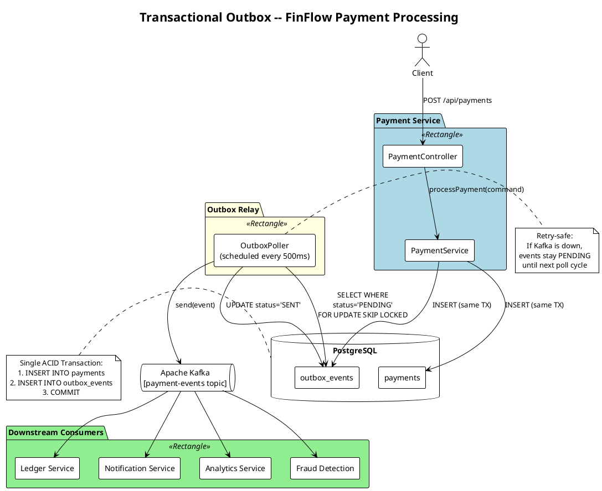
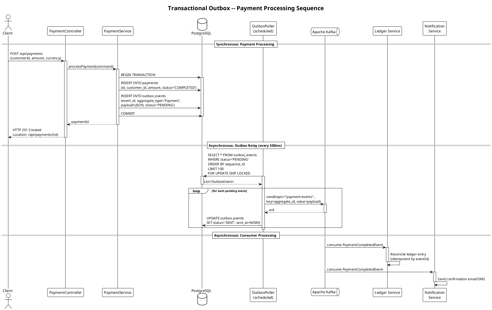

# Transactional Outbox -- Real-World Scenario

## Payment Processing Service at FinFlow

### Business Context

**FinFlow** is a fintech company operating a payment gateway that processes **50,000 payment transactions per day**. When a payment is completed, several downstream systems must be notified:

| Downstream Consumer | What It Needs | Consequence of Missing Event |
|---------------------|--------------|------------------------------|
| **Ledger Service** | `PaymentCompletedEvent` | Financial reconciliation errors; regulatory audit failures |
| **Notification Service** | `PaymentCompletedEvent` | Customer never receives payment confirmation email/SMS |
| **Analytics Service** | `PaymentCompletedEvent` | Revenue dashboards show stale data; business intelligence gaps |
| **Fraud Detection Service** | `PaymentCompletedEvent` | Cannot build real-time transaction velocity models |

All downstream communication flows through **Apache Kafka**.

---

### The Business Problem

The original implementation looked like this:

```java
@Transactional
public void processPayment(PaymentRequest request) {
    // Step 1: Persist payment to database
    Payment payment = paymentRepository.save(mapToEntity(request));

    // Step 2: Publish event to Kafka
    kafkaTemplate.send("payment-events", toEvent(payment));  // <-- DUAL WRITE
}
```

**What goes wrong:**

1. **Scenario A -- Kafka is down:** The database transaction commits, but the `kafkaTemplate.send()` throws an exception. The payment is recorded but no event is published. The Ledger Service never reconciles the payment. **Money is lost in the books.**

2. **Scenario B -- Service crashes after DB commit:** The transaction commits at `Step 1`. Before `Step 2` executes, the JVM crashes. Same result as Scenario A.

3. **Scenario C -- Network partition:** The Kafka broker acknowledges the message, but the acknowledgement is lost. The service retries, publishing a **duplicate event**. The Ledger Service double-counts the payment.

4. **Scenario D -- Ordering violation:** Two payments P1 and P2 are processed. P1's Kafka publish is delayed by network congestion. P2's event arrives at the Ledger Service first. The ledger sees an out-of-order stream.

**The root cause:** Two separate systems (PostgreSQL and Kafka) are being written to without a shared transaction boundary. This is the **dual-write problem**.

---

### Why the Transactional Outbox Solves This

| Problem | How Outbox Fixes It |
|---------|-------------------|
| Kafka is down | Event is safely stored in the outbox table. The relay retries until Kafka is available. |
| Service crashes after commit | Both the payment and the outbox row were written in the same transaction. The relay picks up the row on restart. |
| Duplicate delivery | The relay marks rows as `SENT` after Kafka acknowledges. Consumers implement idempotency using the event ID. |
| Ordering violation | The outbox table has an auto-increment `sequence_id`. The relay publishes in order. Kafka topic partitioning by `aggregate_id` preserves per-payment ordering. |

**The key insight:** By writing the event to a database table in the same transaction as the business data, we convert a distributed consistency problem into a local consistency problem. The database guarantees atomicity. The relay provides eventual delivery.

---

### Architecture Diagram (PlantUML)



### Sequence Diagram -- Payment Processing Flow (PlantUML)



**Rendered as ASCII:**

```
  Client
    |
    v
+---+-----------+
| Payment       |       +---------------------+
| Controller    |       |     PostgreSQL       |
+---+-----------+       |                     |
    |                   | +-------+ +-------+ |
    v                   | |payments| |outbox | |
+---+-----------+       | |  table | | table | |
| Payment       |------>| +-------+ +-------+ |
| Service       | BEGIN |                     |
| (single tx)   | INSERT payments             |
|               | INSERT outbox               |
|               | COMMIT|                     |
+---------------+       +----------+----------+
                                   |
                        +----------v----------+
                        | Outbox Poller       |
                        | (every 500ms)       |
                        +----------+----------+
                                   |
                        +----------v----------+
                        | Apache Kafka        |
                        | [payment-events]    |
                        +----+----------+-----+
                             |          |
                    +--------v--+  +----v--------+
                    | Ledger    |  | Notification|
                    | Service   |  | Service     |
                    +-----------+  +-------------+
```

---

### Data Flow -- Step by Step

#### Happy Path: Payment Processed Successfully

```
Step 1   Client submits POST /api/payments with amount, currency, customer ID,
         and payment method token.

Step 2   PaymentController deserialises the request into a ProcessPaymentCommand.

Step 3   PaymentService opens a database transaction (@Transactional).

Step 4   PaymentService validates the command:
         - Customer exists and is active
         - Amount > 0
         - Currency is supported
         - Payment method token is valid (calls payment processor)

Step 5   PaymentService persists the Payment entity to the `payments` table.

Step 6   PaymentService creates an OutboxEvent with:
         - aggregate_type = "Payment"
         - aggregate_id = payment.getId()
         - event_type = "PaymentCompletedEvent"
         - payload = JSON-serialised event data
         - status = PENDING
         PaymentService persists the OutboxEvent to the `outbox_events` table.

Step 7   The database transaction COMMITS atomically.
         Both the payment row and the outbox row are now durable.

Step 8   PaymentService returns the payment ID to the controller.
         Controller responds HTTP 201 Created.

Step 9   (Async) The OutboxPoller runs every 500ms. It queries:
         SELECT * FROM outbox_events WHERE status = 'PENDING'
         ORDER BY sequence_id LIMIT 100

Step 10  The poller serialises each row into a Kafka ProducerRecord
         and sends it to the `payment-events` topic.
         The Kafka partition key is the aggregate_id (payment ID),
         ensuring all events for one payment land on the same partition.

Step 11  Upon receiving Kafka's acknowledgement, the poller updates
         the outbox row: SET status = 'SENT', sent_at = NOW().

Step 12  Downstream consumers (Ledger, Notification, Analytics, Fraud)
         receive the PaymentCompletedEvent and process it.
```

#### Failure Scenario: Kafka Unavailable

```
Step 1-8   Same as above. The payment and outbox row are committed.

Step 9     The OutboxPoller attempts to send to Kafka.
           Kafka is unreachable. The send fails with a TimeoutException.

Step 10    The poller logs the failure and does NOT update the outbox row.
           The row remains status = 'PENDING'.

Step 11    On the next polling cycle (500ms later), the same row is picked
           up again. The poller retries.

Step 12    This continues until Kafka recovers.
           Once Kafka is back, the event is delivered and the row is
           marked SENT.

           No events are lost. The worst case is delayed delivery.
```

#### Failure Scenario: Service Crashes After DB Commit

```
Step 1-7   The transaction commits. Payment and outbox row are durable.

Step 8     The JVM crashes before the HTTP response is sent.

Step 9     On restart, the OutboxPoller resumes its polling schedule.
           It finds the PENDING outbox row and publishes it to Kafka.

           The event is delivered. The only impact is a brief delay.
```

---

### Delivery Guarantees

| Guarantee | Achieved By |
|-----------|------------|
| **At-least-once delivery** | The poller retries until Kafka acknowledges. If the service crashes after Kafka ack but before marking the row SENT, the event may be re-published on restart. |
| **Idempotent processing** | Each outbox event carries a unique `event_id` (UUID). Consumers use this to deduplicate. |
| **Causal ordering** | The outbox table has an auto-incrementing `sequence_id`. The poller processes rows in order. Kafka partitioning by `aggregate_id` preserves per-aggregate ordering. |
| **No distributed transactions** | The outbox table lives in the same database as the business data. A single local transaction is sufficient. |

---

### Polling vs. CDC (Debezium)

| Dimension | Polling (implemented here) | CDC with Debezium |
|-----------|--------------------------|-------------------|
| Latency | 100--500ms (polling interval) | Near real-time (~10ms, tails WAL) |
| Complexity | Simple: scheduled task, SQL query | Moderate: Debezium connector, Kafka Connect cluster |
| Database load | Periodic queries on the outbox table | Reads the WAL; no queries on the table |
| Operational overhead | Low: runs inside the application | Higher: separate infrastructure component |
| Ordering guarantees | Explicit via `sequence_id` | Implicit via WAL position |
| Recommended for | Small-to-medium throughput (<100 events/sec) | High throughput (>100 events/sec) |

This implementation uses **polling** because it is simpler to understand, requires no additional infrastructure, and meets FinFlow's throughput requirements (~0.6 events/sec average).

---

### Trade-offs

| Advantage | Cost |
|-----------|------|
| No lost events (at-least-once) | Consumers must be idempotent |
| No distributed transactions | Outbox table adds storage and I/O overhead |
| Works with any message broker | Polling introduces latency (configurable) |
| Events are auditable (stored in DB) | Outbox table must be cleaned up periodically |
| Simple to implement and reason about | Tight coupling between service and its database |

---

### Best Practices for This Scenario

1. **Use `GENERATED ALWAYS AS IDENTITY` for `sequence_id`.** PostgreSQL's identity columns guarantee strict monotonic ordering, which the poller relies on for ordered delivery.
2. **Partition Kafka topic by `aggregate_id`.** All events for one payment land on the same partition, preserving causal ordering for that aggregate.
3. **Configure `acks=all` and `enable.idempotence=true` on the Kafka producer.** This prevents duplicates from producer retries at the broker level.
4. **Implement consumer-side idempotency.** Store processed `eventId` values in a `processed_events` table and check before processing. This handles at-least-once delivery semantics.
5. **Use partial indexes on the outbox table.** `CREATE INDEX ... WHERE status = 'PENDING'` ensures the poller's query is fast even when the table has millions of `SENT` rows.

---

*Next: [implementation.md](./implementation.md) -- full Java code for the payment outbox.*
